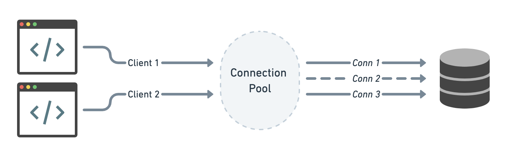

<div align="center"> <h1> TCPconnPool </h1></div>


<!-- TABLE OF CONTENTS -->
<details open="open">
  <summary>Table of Contents</summary>
  <ol>
    <li>
      <a href="#about-the-project">About The Project</a>
      <ul>
        <li><a href="#built-with">Built With</a></li>
      </ul>
    </li>
    <li>
      <a href="#getting-started">Getting Started</a>
      <ul>
        <li><a href="#prerequisites">Prerequisites</a></li>
        <li><a href="#installation">Installation</a></li>
      </ul>
    </li>
    <li><a href="#usage">Usage</a></li>
    <li><a href="#roadmap">Roadmap</a></li>
    <li><a href="#contributing">Contributing</a></li>
    <li><a href="#license">License</a></li>
    <li><a href="#contact">Contact</a></li>
    
  </ol>
</details>


<!-- ABOUT THE PROJECT -->
## About The Project



Thread safe TCP Connection Pooling package in golang. For a server, a pool of connections can be maintained so requests to that server can use an available connection in the pool rather than waiting on initiating a connection. Using existing connections delivers requests to that server faster, and decreases connection setup and tear-down overhead. Connection Pooling also reduces the server load, which frees resources to handle other important tasks. 


### Built With

* [Golang](https://golang.org)


### Prerequisites

* golang
1. [Install Go](https://golang.org/doc/install)
2. Download the Go installer and run it.
3. Verify your installation by running
  ```sh
  $ go version
  ```

### Installation

 ```sh
   $ go get -t github.com/arjunmann73/TCPconnPool
   ```


<!-- USAGE EXAMPLES -->
## Usage

 ```go
 func main() {
 ...
 
     // Creating a pool with 5 initial connections and maximum connects possible = 30.
     if pool, err := TCPconnPool.CreateConnectionPool(5, 30); err != nil {
          log.Fatal("error in creation of connection pool")
     }
 ...
 ...
 
     // Retrieving a connection from the pool
     if conn, err := pool.GetOneConnection(); err != nil {
          log.Fatal("error in retriving a connection")
     }
 ...
 ...
 
     // Putting a connection back into the pool, does not close the underlying connection.
     if err := pool.PutOneConnection(conn); err != nil {
          log.Fatal("error in putting a connection back into the pool")
     }
 }
 ```


<!-- ROADMAP -->
## Roadmap

See the [open issues](https://github.com/othneildrew/Best-README-Template/issues) for a list of proposed features (and known issues).


<!-- CONTRIBUTING -->
## Contributing

Contributions are what make the open source community such an amazing place to be learn, inspire, and create. Any contributions you make are **greatly appreciated**.

1. Fork the Project
2. Create your Feature Branch (`git checkout -b feature/AmazingFeature`)
3. Commit your Changes (`git commit -m 'Add some AmazingFeature'`)
4. Push to the Branch (`git push origin feature/AmazingFeature`)
5. Open a Pull Request


<!-- LICENSE -->
## License

Distributed under the MIT License. See `LICENSE` for more information.


<!-- CONTACT -->
## Contact

[Arjun Singh Mann](https://www.instagram.com/a.xjun/) - arjunmann73@gmail.com


